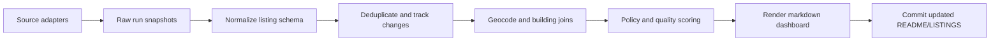

# NYC Apartment Intelligence Plan

Last updated: 2026-05-04

This is the single working plan for the project. Keep durable decisions here instead of spreading them across many docs.

## Goal

Build a frequently refreshed rental intelligence feed for NYC and nearby apartments. The first useful interface is the GitHub README: a scheduled pipeline should collect listings, normalize them, dedupe them, enrich them with NYC housing-policy signals, rank them, and rewrite a generated listing section.

The dashboard should answer:

- What promising listings appeared since the last run?
- Which listings match current criteria, such as 2 bedrooms under $4,400?
- Which listings have rent-stabilization, 421-a, J-51, or Good Cause Eviction signals?
- Which listings are duplicates, stale, suspicious, overpriced, or low-value?
- What changed: new listing, price drop, removed listing, relisted unit, new policy flag?

## Current Recommendation

Start with unified Apify ingestion and prove the loop:

1. StreetEasy via a prebuilt Apify actor.
2. Craigslist via a dedicated Apify actor.
3. Facebook Marketplace via a dedicated Apify actor.

The core data model should not depend on Apify, email parsing, or any single source. Every source should be an adapter that can be replaced later.

## Source Priorities

| Source | Priority | Initial approach | Reason |
| --- | --- | --- | --- |
| StreetEasy | A | Apify actor first | Highest-value mainstream NYC rental source |
| Craigslist | A | Apify actor configured but disabled until hard caps are proven | Useful direct-owner and oddball inventory, but requires careful handling |
| Facebook Marketplace | B | Apify actor first with manual-review flags | Potentially high volume, but noisy and scam-prone |
| RentHop | B | Evaluate after MVP | NYC-focused and may have useful quality signals |
| LeaseBreak | B/C | Custom adapter later | Good for lease assignments and short-term opportunities |
| Zillow/HotPads/Trulia | B/C | Only if overlap analysis justifies it | Useful outside core NYC, likely overlaps StreetEasy |
| Apartments.com/Realtor/Rent.com | C | Later test | More useful for nearby NJ/Westchester/Long Island |
| NYC Housing Connect | C | Later official-data source | Affordable housing, but not a normal same-day rental feed |

Public README output should link to original listings and show compact factual fields. Avoid republishing full descriptions, full photo sets, seller personal details, or copied listing prose.

## Architecture



Use generated-section markers so automation can rewrite the feed without trampling hand-written documentation:

```md
<!-- NYC_APARTMENT_FEED_START -->
generated content
<!-- NYC_APARTMENT_FEED_END -->
```

Minimum modules once implementation begins:

- `src/sources/`: StreetEasy, Craigslist, Facebook, and future source adapters.
- `src/normalize/`: price, beds, baths, fee, address, and amenity parsing.
- `src/filters.py`: criteria and source-specific noise filtering.
- `src/dedupe/`: source URL, source ID, address/unit/price, and fuzzy matching.
- `src/enrich/`: geocoding, BBL/BIN lookup, public data joins, tax-benefit signals.
- `src/scoring/`: search criteria, value scoring, policy confidence, noise/scam flags.
- `src/render/`: README and `LISTINGS.md` generation.

## Canonical Listing Fields

Minimum useful fields:

- `source`, `source_listing_id`, `source_url`
- `first_seen_at`, `last_seen_at`, `scraped_at`, `status`
- `title`, `raw_address`, `normalized_address`, `unit`, `building_name`
- `borough`, `neighborhood`, `city`, `state`, `zip`
- `latitude`, `longitude`, `bbl`, `bin`
- `price`, `net_effective_price`, `gross_price`, `months_free`
- `bedrooms`, `bathrooms`, `square_feet`
- `no_fee`, `broker_fee_known`, `fee_notes`
- `available_at`, `lease_term`
- `agent_name`, `brokerage`, `contact_url`
- `dedupe_key`, `canonical_listing_id`
- `policy_flags`, `quality_flags`, `score`, `score_reasons`

## Policy And Building Data

Treat policy data as an evidence layer, not a legal determination layer. A building-level signal should never be presented as proof that a specific apartment is rent stabilized.

Important signals:

- Rent Guidelines Board/HCR stabilized building lists: strong building-level signal, not unit-level proof.
- 421-a: active or historical tax-benefit signal by BBL, especially useful for newer buildings early in the benefit period.
- J-51: active or historical renovation benefit signal by BBL.
- Pre-1974 and 6+ units: useful rent-stabilization candidate heuristic when combined with other evidence.
- Good Cause Eviction: post-signing protection/risk signal for many unregulated units, with exemptions.

Suggested confidence labels:

- `verified_source_claim`: listing explicitly claims rent stabilized.
- `building_registered_rs`: building appears on stabilized building list.
- `tax_benefit_active`: active 421-a/J-51 signal by BBL.
- `tax_benefit_historical`: historical 421-a/J-51 signal by BBL.
- `pre_1974_6plus_candidate`: heuristic candidate.
- `good_cause_likely`, `good_cause_unclear`, `good_cause_unlikely`
- `unit_status_unknown`: no unit-level proof.

The `firstmovernyc/nyc-rent-stabilized-listings` repo is useful for RGB PDF parsing and address normalization lessons, but it is not a complete listing aggregator.

Current implementation:

- Uses NYC Planning GeoSearch to resolve likely street addresses to BBL, BIN, borough, ZIP, coordinates, and neighborhood.
- Uses NYC Open Data DOF Property Abatement Detail for J-51 signals by BBL.
- Supports local 421-a BBL CSV input at `data/policy/421a-bbls.csv`; this is intentionally local until we wire the current DOF 421-a Excel reports into an automated importer.
- Applies manual/example building signals from `data/policy/building-signals.example.csv`.

## Roadmap

### Phase 1: Listing Feed MVP

- Create Python project structure.
- Define canonical listing model.
- Add StreetEasy Apify adapter.
- Add Craigslist Apify adapter, then enable only after validating cost controls.
- Add Facebook Marketplace Apify adapter.
- Store current normalized listings.
- Render `LISTINGS.md` and a generated README section.
- Add basic dedupe.
- Add a GitHub Actions schedule.

### Phase 2: Policy Enrichment

- Resolve listing addresses to BBL/BIN. Initial GeoSearch integration is in place.
- Ingest stabilized building list data.
- Ingest 421-a and J-51 data. J-51 lookup and local 421-a CSV support are in place.
- Add pre-1974/6+ unit heuristic.
- Add Good Cause classifier.
- Show confidence labels and evidence.

### Phase 3: Ranking And Alerts

- Add `config/search.example.toml` for criteria.
- Rank by price, bedrooms, neighborhoods, commute, no-fee, pets, and move-in date.
- Track price drops, relists, and removed listings.
- Add Slack/email/SMS notifications only for high-value changes.

## Key Sources

- StreetEasy Apify actor: https://apify.com/crawlerbros/streeteasy-scraper
- Craigslist Apify actor: https://apify.com/ivanvs/craigslist-scraper-pay-per-result
- Facebook Marketplace Apify actor: https://apify.com/apify/facebook-marketplace-scraper
- Zillow Group terms, including StreetEasy: https://www.zillow.com/corporate/terms-of-use/
- Craigslist terms: https://www.craigslist.org/about/terms.of.use/en
- Craigslist saved search alerts: https://www.craigslist.org/about/help/account/features/alerts
- NYC Rent Guidelines Board stabilized building lists: https://rentguidelinesboard.cityofnewyork.us/resources/rent-stabilized-building-lists/
- NYC Department of Finance 421-a reports: https://www.nyc.gov/site/finance/property/benefits-421a.page
- NYC Department of Finance J-51 reports: https://www.nyc.gov/site/finance/property/benefits-j51.page
- NY HCR Good Cause Eviction: https://hcr.ny.gov/good-cause-eviction
- Housing Data Coalition: https://www.housingdatanyc.org/
- firstmovernyc rent-stabilized listings repo: https://github.com/firstmovernyc/nyc-rent-stabilized-listings
- NYC Planning GeoSearch: https://geosearch.planninglabs.nyc/docs/
- NYC Open Data DOF Property Abatement Detail: https://data.cityofnewyork.us/d/rgyu-ii48

## Current Live Smoke Notes

- `APIFY_API_TOKEN` is the only required local Apify credential. The Apify user ID is useful for confirmation but not needed by the code.
- StreetEasy live smoke succeeded with 3 listings.
- Facebook Marketplace live smoke succeeded with 3 listings, all flagged for manual review.
- Craigslist live smoke was aborted because the tested pay-per-result actor attempted to crawl hundreds of records despite the local smoke cap. Keep Craigslist disabled until we select a controllable actor or build a safer source-specific adapter.
- While on the Apify free plan, scheduled GitHub Actions runs are capped at 25 StreetEasy and 25 Facebook results every 4 hours. Increase limits and cadence after validating cost.
- GitHub Actions restores source/geocode/tax caches so a transient source failure does not wipe prior listings.
